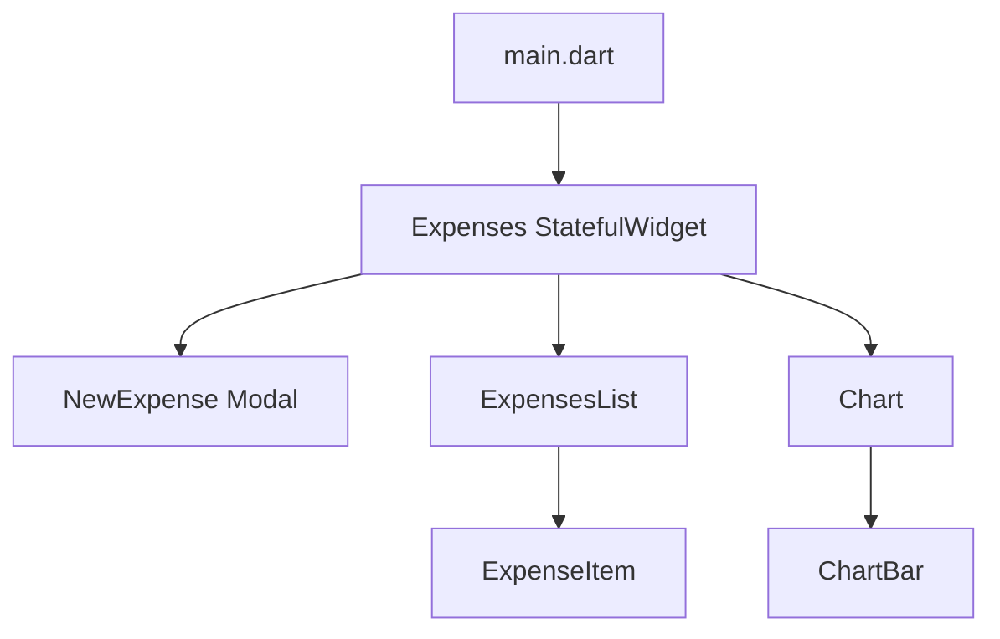
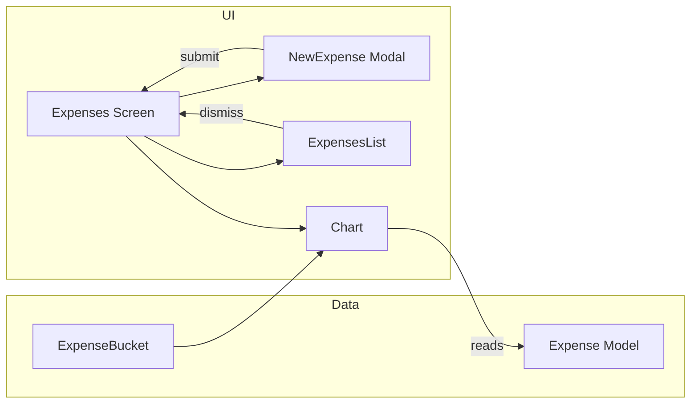
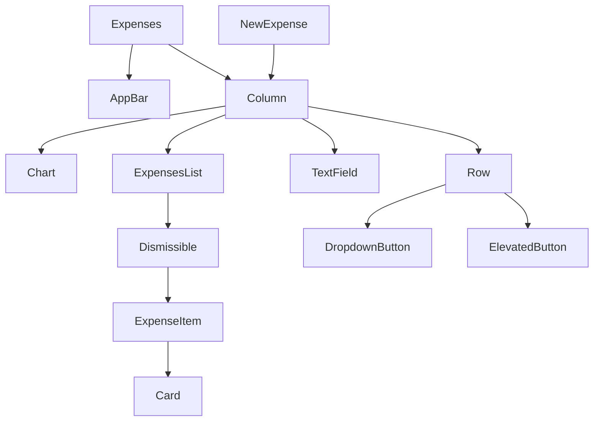

# Expense Tracker Course Notes

This note file summarizes the project implementation and maps it to the lesson topics in your course. It includes code references, architecture notes, and diagrams to help you quickly understand how the app works.

---

## 1. Module Introduction

- The app is a Flutter expense tracker.
- Main entry point: `lib/main.dart`.
- Root widget: `Expenses` in `lib/expenses.dart`.
- App is built with Material 3 theme support.
- Key flows: add expense, view list, dismiss expense, show chart.

**Project architecture**
- `lib/main.dart` : app theme and top-level `MaterialApp`.
- `lib/expenses.dart` : main stateful screen.
- `lib/new_expense.dart` : modal input form.
- `lib/Model/expense.dart` : data model and enums.
- `lib/expenses_list.dart` : list rendering with Dismissible.
- `lib/widgets/expenses_list/expense_item.dart` : expense row UI.
- `lib/widgets/chart/chart.dart` : chart widget.
- `lib/widgets/chart/chart_bar.dart` : single chart bar.



---

## 2. Starting Setup & Repetition Time!

- Flutter app uses `pubspec.yaml` dependencies: `flutter`, `uuid`, `intl`, `cupertino_icons`.
- Start by defining the app theme and home widget in `main.dart`.
- Repetition: build the same UI patterns repeatedly using widgets like `Row`, `Column`, `TextField`, `IconButton`, `Card`, `ListView`.
- `ThemeData` and `ColorScheme` are reused for light/dark themes.

---

## 3. Adding an Expense Data Model with a Unique ID & Exploring Initializer Lists

- Data model located in `lib/Model/expense.dart`.
- Class `Expense` includes `title`, `amount`, `date`, `categories`, and generated `id`.
- Unique ID created using `uuid` package.
- Initializer list used to assign `id` before the constructor body.

```dart
Expense({
  required this.title,
  required this.amount,
  required this.date,
  required this.categories,
}) : id = uuid.v4();
```

- `formattedDate` is a getter that formats `date` using `intl`.

---

## 4. Introducing Enums

- Enum is defined in `lib/Model/expense.dart`:

```dart
enum Categories { food, leisure, travel, work }
```

- Enums provide a fixed set of categories.
- UI uses `Categories.values` to generate dropdown items.
- `CategoriesIcons` map links each enum value to an icon.

---

## 5. Creating Dummy Data

- Dummy expenses are created in `_registeredExpenses` inside `lib/expenses.dart`.
- Example entries:
  - `Flutter Course`, `Cinema`.
- This data appears immediately when the app starts.
- It is useful for testing list rendering and chart behavior.

---

## 6. Efficiently Rendering Long Lists with ListView

- List rendering is in `lib/expenses_list.dart`.
- Uses `ListView.builder` for efficiency.
- `itemCount` is `expenses.length`.
- `itemBuilder` builds each row lazily.
- This is the recommended approach for long lists.

```dart
ListView.builder(
  itemCount: expenses.length,
  itemBuilder: (context, index) => ...
)
```

---

## 7. Using Lists Inside Of Lists

- The app shows nested list structure in the chart and category processing.
- `ExpenseBucket.forCategory` filters expenses per category.
- `Chart` uses a `for` loop that returns `ChartBar` widgets inside a `Row`.
- `buckets.map(...).toList()` is used in the chart label row.

---

## 8. Creating a Custom List Item with the Card & Spacer Widgets

- Custom row UI in `lib/widgets/expenses_list/expense_item.dart`.
- Uses `Card` for visual grouping.
- `Padding` and `SizedBox` create spacing.
- `Spacer()` pushes date/icon to the right side.

```dart
Row(
  children: [
    Text('\$${expense.amount.toStringAsFixed(2)}'),
    const Spacer(),
    Row(...)
  ],
)
```

---

## 9. Using Icons & Formatting Dates

- Icons come from `CategoriesIcons` map.
- Example mapping:
  - `Categories.food` → `Icons.lunch_dining`
  - `Categories.leisure` → `Icons.movie`
- Date formatting uses `DateFormat.yMd()`.
- `expense.formattedDate` returns formatted date string.

---

## 10. Setting an AppBar with a Title & Actions

- AppBar is in `lib/expenses.dart`.
- Title: `Expense Tracker`.
- Action button to add a new expense:

```dart
IconButton(onPressed: _openAddExpenseOverlay, icon: Icon(Icons.add))
```

- The action opens the modal sheet.

---

## 11. Adding a Modal Sheet & Understanding Context

- `showModalBottomSheet` is used in `_openAddExpenseOverlay()`.
- Modal receives current `context` and returns `NewExpense`.
- `isScrollControlled: true` allows modal sizing to follow content.
- `builder: (ctx) => NewExpense(_addExpenses)` passes callback to child.

---

## 12. Handling User (Text) Input with the TextField Widget

- `TextField` widgets are in `lib/new_expense.dart`.
- Two TextFields:
  - Title input
  - Amount input
- `keyboardType: TextInputType.number` for amount.
- `InputDecoration` adds labels and prefix text.

---

## 13. Getting User Input on Every Keystroke

- This project does not currently use `onChanged` callbacks for live keystroke handling.
- It uses `TextEditingController` instead, which is simpler for form submission.
- If you need every keystroke, `TextField(onChanged: ...)` is the standard method.

---

## 14. Letting Flutter do the Work with TextEditingController

- Two controllers are used in `lib/new_expense.dart`:
  - `_titleController`
  - `_amountController`
- The controllers capture final values when the user saves.
- They are disposed in `dispose()` to free resources.

```dart
final _titleController = TextEditingController();
final _amountController = TextEditingController();

@override
void dispose() {
  _titleController.dispose();
  _amountController.dispose();
  super.dispose();
}
```

---

## 15. Time to Practice: Adding a New Input

- The app already includes a new input for category selection.
- Additional practice could add a note field or a merchant field.
- Example pattern: add field to model, controller in form, and display in `ExpenseItem`.

---

## 16. Exercise Solution

- The current app is a working solution for adding expenses.
- Saving happens through `_submitExpenseData()` in `NewExpense`.
- Validation and modal closing happen after data creation.

---

## 17. Closing The Modal Manually

- The cancel button in `NewExpense` closes the modal.

```dart
TextButton(
  onPressed: () {
    Navigator.pop(context);
  },
  child: Text('Cancel'),
)
```

- The modal also closes automatically after saving in `_addExpenses()` via `Navigator.pop(context)`.

---

## 18. Showing a Date Picker

- `_presentDatePicker()` uses `showDatePicker`.
- It waits for the user to choose a date with `await`.
- Selected date is stored in `_selectedDate`.

```dart
final pickedDate = await showDatePicker(...);
setState(() {
  _selectedDate = pickedDate;
});
```

- The displayed text updates to `No Date Selected` or the formatted value.

---

## 19. Working with "Futures" for Handling Data from the Future

- `showDatePicker` returns a `Future<DateTime?>`.
- The code uses `async` / `await` to pause until the picker closes.
- Always check for `null` when the user cancels.

---

## 20. Adding a Dropdown Button

- Dropdown is used for category selection in `NewExpense`.
- `DropdownButton` value is `_selectedCategory`.
- Items created from `Categories.values`.

```dart
DropdownButton(
  value: _selectedCategory,
  items: Categories.values.map((category) => DropdownMenuItem(...)).toList(),
  onChanged: (value) {
    if (value == null) return;
    setState(() { _selectedCategory = value; });
  },
)
```

---

## 21. Combining Conditions with AND and OR Operators

- Validation in `_submitExpenseData()` uses operators:

```dart
if (_titleController.text.trim().isEmpty ||
    (enteredAmount == null && enteredAmount! <= 0)) {
```

- Important note: the current logic is incorrect because `enteredAmount == null && enteredAmount! <= 0` always evaluates to `false` when `enteredAmount` is `null` due to short-circuiting and then `enteredAmount!` would crash.
- Correct validation should be:

```dart
if (_titleController.text.trim().isEmpty ||
    enteredAmount == null ||
    enteredAmount <= 0 ||
    _selectedDate == null) {
```

- This is a good lesson on combining AND/OR safely.

---

## 22. Validating User Input & Showing an Error Dialog

- Validation is performed before creating an expense.
- Invalid input triggers `showDialog` with `AlertDialog`.
- Dialog includes a title, message, and `TextButton`.

```dart
showDialog(
  context: context,
  builder: (ctx) => AlertDialog(...),
);
```

---

## 23. Saving New Expenses

- `_submitExpenseData()` constructs a new `Expense` and passes it to `widget.onaddExpenses`.
- Parent `_ExpensesState` adds the new expense to `_registeredExpenses`.
- `setState()` triggers UI refresh.

```dart
widget.onaddExpenses(Expense(...));
```

- Modal closes with `Navigator.pop(context)` after saving.

---

## 24. Creating a Fullscreen Modal

- The app does not use a `fullscreenDialog`, but modal behavior is close to fullscreen via `isScrollControlled: true`.
- A true fullscreen route can use `showModalBottomSheet` with custom height or `Navigator.of(context).push(MaterialPageRoute(fullscreenDialog: true, ...))`.

---

## 25. Using the Dismissible Widget for Dismissing List Items

- `Dismissible` wraps each expense in `ExpensesList`.
- Swiping removes the item and calls `onRemoveExpense`.
- Key is `ValueKey(expenses[index])`.

```dart
Dismissible(
  key: ValueKey(expenses[index]),
  child: ExpenseItem(expenses[index]),
  onDismissed: (direction) {
    onRemoveExpense(expenses[index]);
  },
)
```

- This makes items removable with a swipe gesture.

---

## 26. SnackBar Durations

- A `SnackBar` is shown when an expense is removed.
- Duration is set explicitly to 3 seconds:

```dart
SnackBar(duration: Duration(seconds: 3), ...)
```

---

## 27. Showing & Managing "Snackbars"

- `ScaffoldMessenger.of(context).clearSnackBars()` clears existing messages before showing a new one.
- `showSnackBar(...)` displays the notification.
- `SnackBarAction` adds an undo button.

```dart
ScaffoldMessenger.of(context).showSnackBar(
  SnackBar(
    content: Text('Expense Deleted'),
    action: SnackBarAction(label: 'Undo', onPressed: ...),
  ),
);
```

- Undo reinserts the deleted expense at its original index.

---

## 28. Flutter & Material 3

- `main.dart` sets `useMaterial3: true` in both themes.
- This changes default component shapes, colors, and elevation behavior.
- Example:

```dart
ThemeData().copyWith(useMaterial3: true, colorScheme: KColorSchema)
```

---

## 29. Getting Started with Theming

- Theme objects are created in `main.dart`.
- `ColorScheme.fromSeed` generates matching palettes.
- Themes are applied to app bar, cards, and general styling.
- Dark theme is also configured.

---

## 30. Setting & Using a Color Scheme

- Light theme color scheme: `KColorSchema`.
- Dark theme color scheme: `DarkColorSchema`.
- AppBar and Card theme colors use the scheme values.
- Example:

```dart
appBarTheme: AppBarTheme().copyWith(
  backgroundColor: KColorSchema.onPrimaryContainer,
  foregroundColor: KColorSchema.primaryContainer,
)
```

---

## 31. Setting Text Themes

- The current app does not define a custom `textTheme` explicitly.
- Text styles are using defaults from Material 3.
- You can extend the theme by adding `textTheme: TextTheme(...)` to `ThemeData`.
- This is a next improvement step.

---

## 32. Using Theme Data in Widgets

- Inside widgets, `Theme.of(context)` is used to color chart icons and bars.
- Example from `Chart`:

```dart
Theme.of(context).colorScheme.primary.withOpacity(0.7)
```

- This ensures UI follows the active theme.

---

## 33. Important: Adding Dark Mode

- Dark mode is supported via `darkTheme` in `main.dart`.
- `useMaterial3: true` is enabled for the dark theme too.
- `Chart` checks `MediaQuery.of(context).platformBrightness == Brightness.dark` to adapt colors.

---

## 34. Adding Dark Mode

- `MaterialApp` in `main.dart` includes both `theme` and `darkTheme`.
- The system brightness controls which theme is active.
- The chart bar color adjusts automatically for dark mode.

---

## 35. Using Another Kind of Loop (for-in)

- `Chart` uses a `for` loop to generate `ChartBar` widgets:

```dart
for (final bucket in buckets)
  ChartBar(...)
```

- This is an idiomatic alternative to `.map().toList()`.

---

## 36. Adding Alternative Constructor Functions & Filtering Lists

- `ExpenseBucket.forCategory` is a named constructor that filters expenses by category.
- It shows how to build custom constructors for specialized behavior.
- Filtering example:

```dart
expenses = allExpenses.where((expense) => expense.categories == categories).toList();
```

---

## 37. Adding Chart Widgets

- Chart is implemented across `lib/widgets/chart/chart.dart` and `lib/widgets/chart/chart_bar.dart`.
- `Chart` computes buckets and max expenses.
- `ChartBar` uses `FractionallySizedBox` with `heightFactor`.
- Chart icons show categories at the bottom.

**Chart Flow**
1. Group expenses by category.
2. Compute totals.
3. Normalize bars by `maxTotalExpense`.
4. Draw each bar with proportional fill.

---

## Quick File Reference

- `lib/main.dart` — app entry and theming
- `lib/expenses.dart` — main expense screen + add/remove logic
- `lib/new_expense.dart` — modal form + validation
- `lib/Model/expense.dart` — expense model, enum, unique ID
- `lib/expenses_list.dart` — list builder + dismissible behavior
- `lib/widgets/expenses_list/expense_item.dart` — expense row layout
- `lib/widgets/chart/chart.dart` — chart component
- `lib/widgets/chart/chart_bar.dart` — chart bar UI

---

## Visual Diagrams

### App Data Flow



### Widget Composition



---

## Notes & Improvement Ideas

- Fix the amount validation logic in `NewExpense._submitExpenseData()`.
- Add `textTheme` customization to `ThemeData` for consistent typography.
- Display category label text in `ExpenseItem` next to the icon.
- Add a `note` field or expense description for practice.
- Save data persistently using `shared_preferences` or local storage.

---

## How to Use These Notes

- Read each section while looking at the corresponding source file.
- Use the Mermaid diagrams to understand the component relationships.
- Add screenshots later in the `Screenshots` section if you want visual references.
- Copy key code examples into your own notes for exam review.
